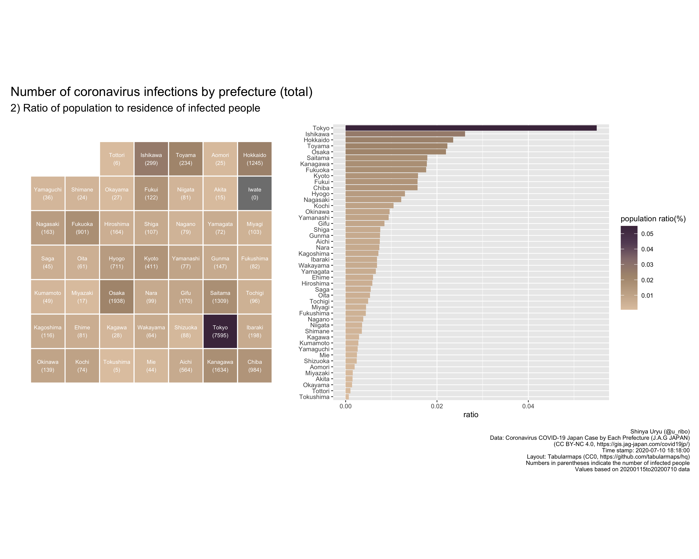
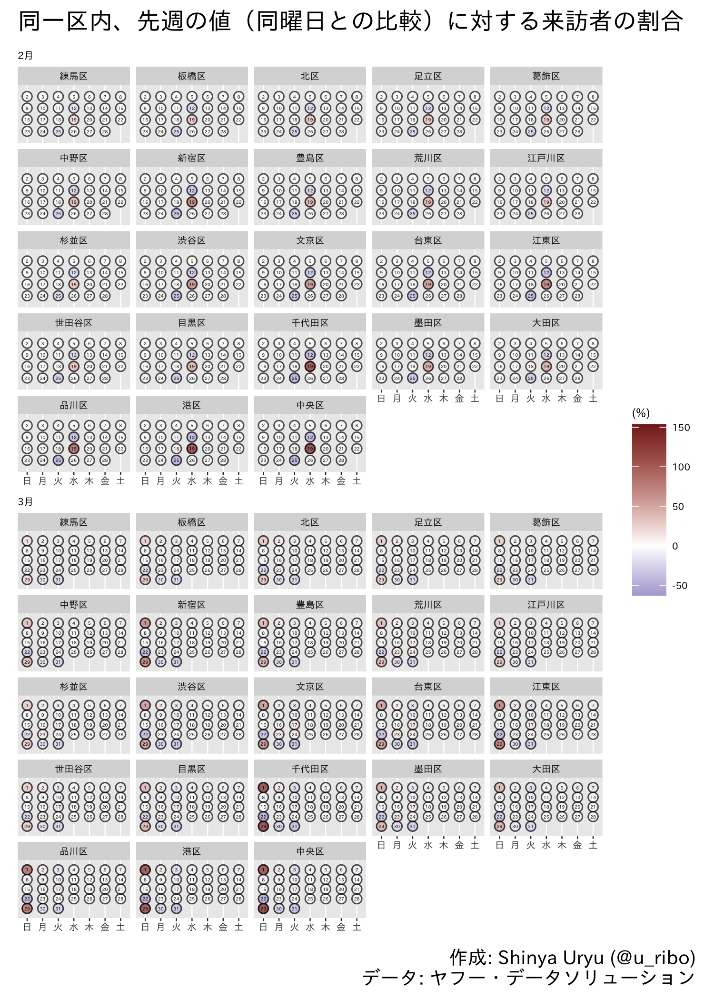

```{r setup, include=FALSE}
knitr::opts_chunk$set(echo = TRUE)
```


日本国内で発生した新型コロナウィルス感染症（COVID-19）のデータを可視化しています。





## データソース

- 都道府県別新型コロナウイルス感染者数マップ　[https://gis.jag-japan.com/covid19jp/](https://gis.jag-japan.com/covid19jp/)（ジャッグジャパン株式会社提供）  ([CC BY-NC 4.0](https://creativecommons.org/licenses/by-nc/4.0/deed.ja))
- [東京23区滞在人口推計値の日別遷移（全体・来訪者・住人）](https://ds.yahoo.co.jp/report/) 出典：[ヤフー・データソリューション](https://ds.yahoo.co.jp/)