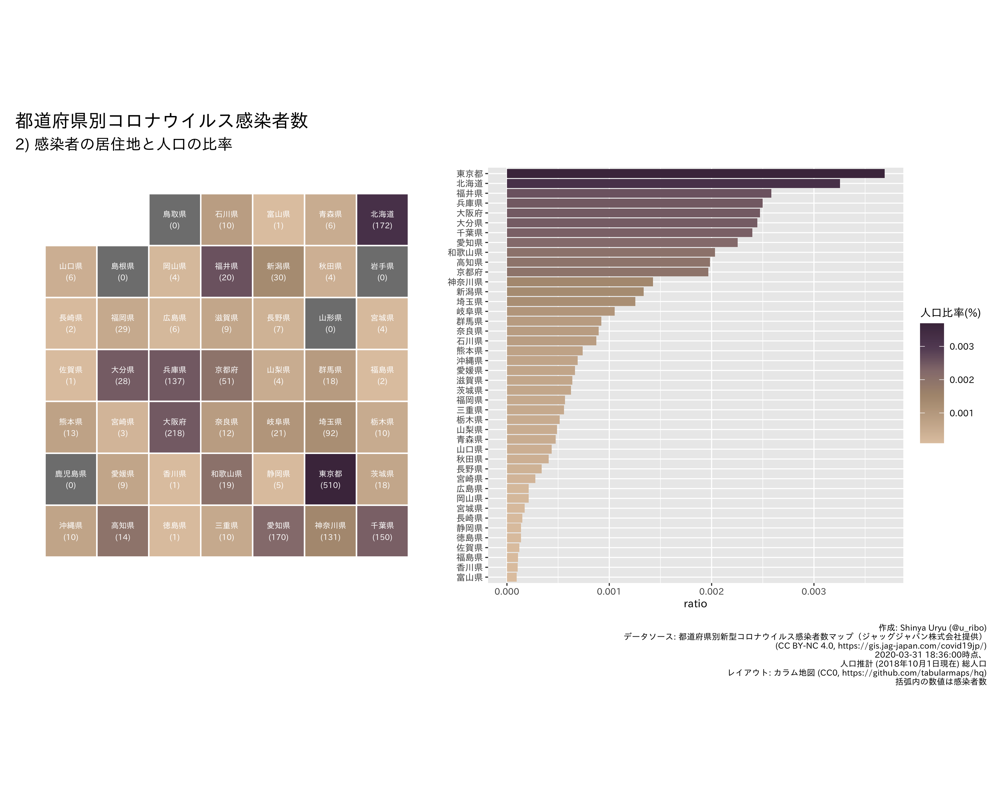

日本国内新型コロナウィルス感染症データの可視化
================

日本国内で発生した新型コロナウィルス感染症（COVID-19）のデータを可視化しています。

## データソース

  - 都道府県別新型コロナウイルス感染者数マップ（ジャッグジャパン株式会社提供） ([CC
    BY-NC 4.0](https://creativecommons.org/licenses/by-nc/4.0/deed.ja))
